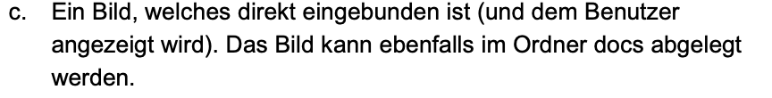

# Black Market Git Repository

## Dieses Repository soll die Black Market GmbH Zukunftsbereit machen, indem .git verwendet wird.

### Dokumentationen

Weiterführende Dokumentationen
- [Verzeichnisstruktur](docs/01_verzeichnisstruktur.md)
- [Branching-Strategie](docs/02_branch_strategie.md)
- [Github-Page](https://argjendmor.github.io/in250-black-market-gmbh/)

### Tasks

- [x] Website erstellen
- [ ] Website korrigieren
- [ ] Website löschen
